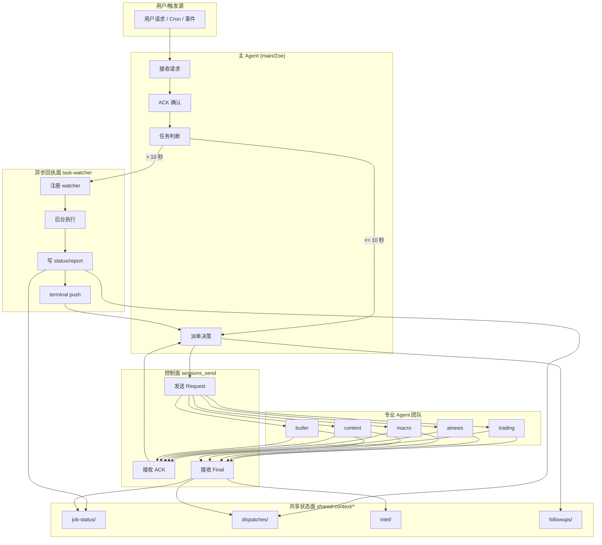
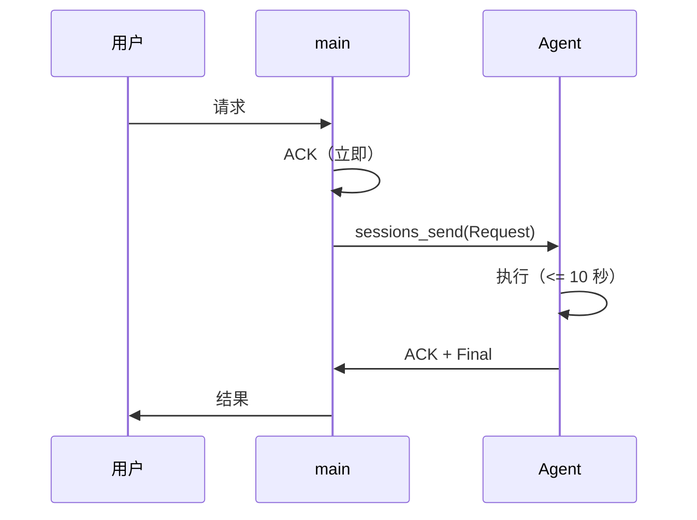
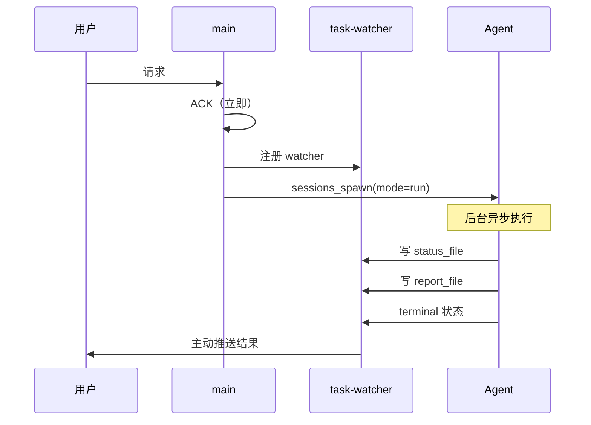
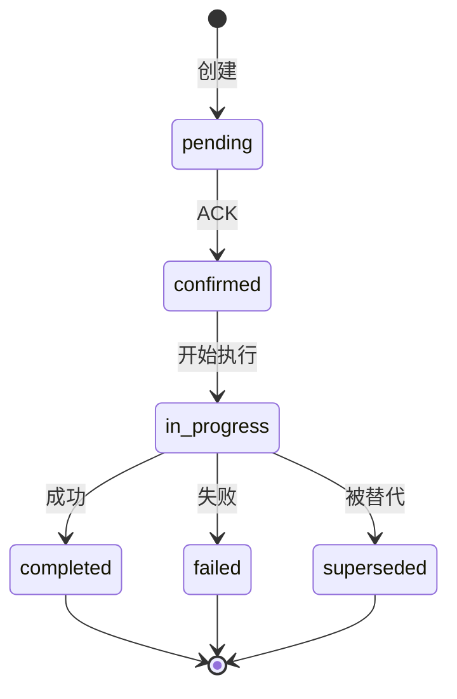
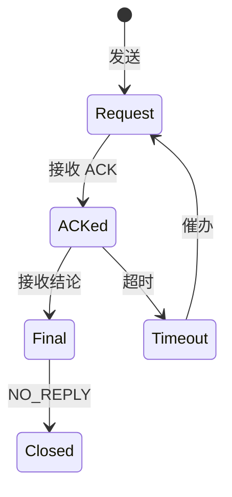

# OpenClaw 多 Agent 协作框架 — 架构说明

<!-- 阅读顺序: 4/5 -->
<!-- 前置: AGENT_PROTOCOL.md -->
<!-- 后续: TEMPLATES.md -->

> Version: 2026-03-12-v1

---

## 概述

本框架为 OpenClaw 多 Agent 团队提供统一的协作协议和架构模式，支持：
- 异步任务执行与状态追踪
- 跨 Agent 控制面通信
- 共享状态管理
- 每日反思与次日落地闭环

---

## 核心架构组件

### 1. 控制面 (Control Plane)

**职责**：任务派发、ACK 确认、简短结论、正式控制面消息

**工具**：`sessions_send`

**特点**：
- 同步或短异步（<= 10 秒）
- 用于 Agent 间直接通信
- 必须带 ack_id 进行追踪

### 2. 异步回执面 (Async Receipt Plane)

**职责**：长任务执行、状态变化通知、终态回推

**工具**：`task-watcher` + `sessions_spawn(mode="run")`

**特点**：
- 适用于 >10 秒的长任务
- 后台执行，终态自动推送
- 状态文件 + 报告文件双落盘

### 3. 共享状态面 (Shared State Plane)

**职责**：协议、任务真值、中间状态、follow-up、intel 存储

**路径**：`shared-context/*`

**关键目录**：
```
shared-context/
├── AGENT_PROTOCOL.md      # 统一协作协议（唯一真值）
├── job-status/            # 任务状态追踪
├── monitor-tasks/         # 监控任务注册
├── dispatches/            # 派单记录
├── intel/                 # 跨 Agent 情报共享
├── followups/             # 每日反思落地追踪
└── archive/               # 历史文档归档
```

---

## 数据流架构



---

## 任务执行流程

### 短任务流程（<= 10 秒）



### 长任务流程（> 10 秒）



---

## 状态机设计

### 任务状态机



### 控制面消息状态



---

## 关键设计模式

### 1. ACK 守门模式

**问题**：Agent 忙于后台处理而忽略即时响应，导致用户/其他 Agent 不确定任务是否收到。

**方案**：
- 强制先 ACK 再处理
- ACK 必须在当前回合完成
- 禁止以"正在查"为由延迟 ACK

### 2. 单写入者模式

**问题**：多线并行时状态冲突，旧线程继续写入导致混乱。

**方案**：
- 每个任务只有一个合法 owner
- 重开/替代时旧线程必须停写
- 新 owner 必须落文件声明所有权

### 3. 真值落盘模式

**问题**：关键状态只存在于聊天历史，无法追溯和审计。

**方案**：
- 关键事实必须写入 shared-context/
- 验收时优先检查文件产物
- 聊天回执仅作为辅助参考

### 4. 反思落地闭环模式

**问题**：每日反思流于形式，次日无实际动作。

**方案**：
- 反思必须产出 followups/YYYY-MM-DD.md
- 次日 09:30 前必须转成实际动作
- 无 owner/无证据路径的事项不算落实

---

## 扩展性设计

### 新增 Agent

1. 在团队配置中注册新 Agent
2. 分配职责边界
3. 配置 sessions_send 路由
4. 培训协议规范

### 新增任务类型

1. 定义任务触发条件
2. 确定执行阈值（同步/异步）
3. 设计状态文件 schema
4. 注册 watcher（如需要）

### 集成外部系统

1. 通过 MCP 服务器接入
2. 封装为 skill
3. 遵循异步执行规范
4. 状态落 shared-context/

---

## 安全与边界

### 权限控制
- Agent 只能访问授权目录
- 敏感操作需要用户确认
- 线上变更遵循预检流程

### 数据隔离
- 各 Agent 工作区隔离
- 共享状态通过 shared-context/
- 密钥不进入共享区

### 审计追踪
- 所有任务有 status_file
- 所有结论有 report_file
- 所有变更有日志

---

## 性能优化

### 并发控制
- 多线并行时显式区分主线/支线
- 避免重复执行相同任务
- 使用缓存减少重复调用

### 资源管理
- 长任务后台执行
- 大文件分块处理
- 网络请求批量执行

### 响应优化
- ACK 优先，结果后补
- 渐进式结果推送
- 超时自动降级

---

## 故障恢复

### 任务失败
1. 记录失败原因到 status_file
2. 通知相关方
3. 决定重试/降级/放弃

### Agent 离线
1. 检测超时
2. 切换到备用 Agent
3. 记录状态变更

### 状态不一致
1. 以 shared-context/ 文件为准
2. 重新同步聊天历史
3. 修复不一致状态

---

## 版本管理

- 协议版本：`YYYY-MM-DD-vN`
- 重大变更升级主版本
- 小改进升级次版本
- 历史版本归档到 archive/


---

## 通信层改进：从轮询到拦截+回调 (2026-03-12)

> 详见 [COMMUNICATION_ISSUES.md](COMMUNICATION_ISSUES.md) 完整分析

### 核心问题

| 问题 | 根因 | 旧方案 | 新方案 |
|------|------|--------|--------|
| ACP 完成不通知 | OpenClaw Bug #40272 | 文件轮询 watcher (5min) | prompt 注入完成回调 |
| timeout 语义模糊 | sessions_send 只有 ok/timeout | 猜 + 重试 | task-log 确定性追踪 |
| Agent 忘记注册 | LLM 肌肉记忆 | 文档约束 | before_tool_call 自动拦截 |

### 新架构数据流

```
Agent -> sessions_spawn(acp)
    | (before_tool_call hook auto-intercept)
spawn-interceptor plugin:
    1. Log to task-log.jsonl
    2. Inject completion relay into ACP prompt
    |
ACP sub-agent executes task
    | (on completion)
ACP -> sessions_send -> completion-relay session
    |
completion-listener -> update task-log -> notify user
```

### 代码量对比

| | 旧方案 (task_callback_bus) | 新方案 |
|---|---|---|
| 核心代码 | 9,600 行 Python | ~600 行 (JS + Python) |
| 轮询频率 | 每 5 分钟 | 无轮询 (事件驱动) |
| 注册方式 | Agent 手动 / wrapper | 自动 (plugin hook) |
| 通知延迟 | 最坏 5 分钟 | < 1 分钟 |

### 实现位置

- `plugins/spawn-interceptor/` — OpenClaw plugin (Node.js)
- `examples/completion-relay/` — 完成监听器 (Python)
